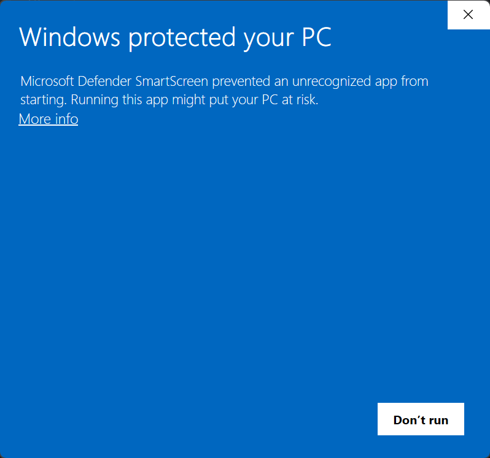

# Windows Setup Guide

This guide will walk you through setting up **AdbAutoPlayer** on a Windows system using **LDPlayer** as the emulator.

---

## Installation

1. **Download the Tool**  
   - Get the latest release of **AdbAutoPlayer**:  
     [AdbAutoPlayer_Windows.zip](https://github.com/yulesxoxo/AdbAutoPlayer/releases/latest).
   - Alternatively, download the CLI version:  
     [AdbAutoPlayer_CLI_Windows.zip](https://github.com/yulesxoxo/AdbAutoPlayer/releases/latest).
   - Extract the contents of the `.zip` file to a folder on your computer.

2. **Install LDPlayer**  
   - Download and install **LDPlayer**: [LDPlayer Download](https://www.ldplayer.net/).

---

## Configuring LDPlayer

1. **Start LDPlayer**  
   Launch the LDPlayer emulator after installation.

2. **Open Settings**  
   Navigate to the settings menu:  
   

3. **Set the Resolution**  
   - Go to **Display**:  
     - **Resolution**: Select **Phone (1080 x 1920)**.

4. **Enable ADB Debugging**  
   - Go to **Others**:  
     - **ADB Debugging**: Enable **Local Connection**.

5. **Save Settings**  
   - Click **Save** and restart the Emulator to apply the changes.

---

## Starting AdbAutoPlayer

When launching AdbAutoPlayer, Windows Defender SmartScreen may block the application. To proceed:  
1. Click the **More info** link.  
2. Click the **Run anyway** button that appears.  
3. Wait for the application to start.  

---

# Continue to the [Troubleshooting Guide](troubleshoot.md)
